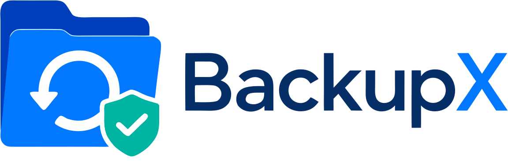
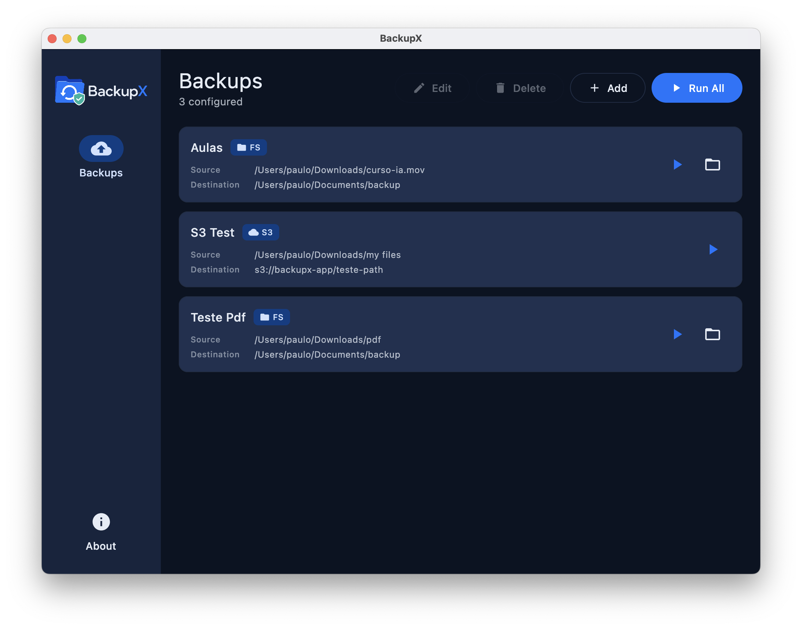

<p align="center">
  <picture>
    <source media="(prefers-color-scheme: dark)" srcset="extras/images/logo_dark.png">
    
  </picture>
</p>

<p align="center">
  <a href="https://github.com/paulocoutinhox/backupx/actions/workflows/build.yml"></a>
  <a href="https://github.com/paulocoutinhox/backupx/releases"></a>
  <a href="LICENSE.txt"></a>
</p>

A cross-platform desktop application to back up your files and folders to the destination of your choice.

## Features

- Create backup entries by choosing a source file or folder and a destination provider
- Provider-based design where each provider exposes its own options
- Run every backup at once or run a single entry on demand
- Background execution with live progress, the interface never freezes
- Per-entry status with clear error messages, the run all action skips failures and keeps going
- Persistent configuration, everything is saved and restored on the next launch so you only press run

## Providers

- **File System** - copies the source file or folder into a destination folder, replacing the existing copy on every run
- **Object Storage (S3)** - uploads the source to an S3-compatible bucket under a new timestamped folder on every run, so previous backups are preserved. Supports a custom endpoint for compatible storage, and a built-in connection test

Each provider exposes its own options in the editor, and new providers can be added by implementing a single provider contract.

### Credentials

The object storage secret key is never written to the config file. It is kept in the operating system secret store and loaded automatically when a backup runs, so you only set it once:

- **macOS** - login Keychain
- **Windows** - Data Protection API (per-user)
- **Linux** - Secret Service (`secret-tool`)

Use a least-privilege key (only the permission to write to the target bucket and prefix).

## Platform Support

- **macOS** - native file and folder dialogs
- **Windows** - native file dialog and folder browser
- **Linux** - native file dialog and the desktop folder chooser

## Configuration

Backups are stored as JSON in `~/.backupx/config.json`. The file holds every entry, provider and option, so the application opens already restored and ready to run. Sensitive secrets are kept out of this file, in the operating system secret store.

## Technology Stack

- **Kotlin Multiplatform** - Cross-platform application logic
- **Compose Multiplatform** - Modern UI framework
- **Coroutines** - Asynchronous operations
- **kotlinx.serialization** - JSON persistence
- **Material Design 3** - Clean and modern interface

## Build & Distribution

### Building from Source

```bash
# Run the application
./gradlew run

# Generate installers for your current platform
./gradlew packageDistributionForCurrentOS

# Platform-specific installers
./gradlew packageDmg    # macOS
./gradlew packageMsi    # Windows
./gradlew packageDeb    # Linux
```

A `Makefile` is also provided for convenience, detecting the host platform automatically:

```bash
make run        # run the app
make build      # compile and assemble the project
make dist       # create the runnable application image
make package    # build the native installer for this platform
```

The generated installers will be available in `composeApp/build/compose/binaries/main/`.

### Checking for Dependency Updates

The project uses the [Gradle Versions Plugin](https://github.com/ben-manes/gradle-versions-plugin) to report outdated dependencies and Gradle versions:

```bash
./gradlew dependencyUpdates
```

The report is printed to the console and written to `build/dependencyUpdates/report.html` and `report.txt`. Pre-release versions (alpha, beta, rc, etc.) are filtered out when the current version is stable.

### Environment Variables

For **macOS** distribution with code signing and notarization, you need to set the following environment variables:

- `SIGNING_IDENTITY` - Your Apple Developer certificate identity (e.g., "Developer ID Application: Your Name (TEAM_ID)")
- `NOTARIZATION_APPLE_ID` - Your Apple ID email address
- `NOTARIZATION_TEAM_ID` - Your Apple Developer Team ID
- `NOTARIZATION_PASSWORD` - App-specific password for notarization (generate at appleid.apple.com)

### References

- **Native Distribution**: [Compose Multiplatform Native Distributions Tutorial](https://github.com/JetBrains/compose-multiplatform/blob/master/tutorials/Native_distributions_and_local_execution/packaging-tools-comparison.md)

### Plugins Versions

- `org.jetbrains.kotlin.multiplatform`: [Gradle Plugin Portal](https://plugins.gradle.org/plugin/org.jetbrains.kotlin.multiplatform)
- `org.jetbrains.compose`: [Gradle Plugin Portal](https://plugins.gradle.org/plugin/org.jetbrains.compose)
- `org.jetbrains.kotlin.plugin.compose`: [Gradle Plugin Portal](https://plugins.gradle.org/plugin/org.jetbrains.kotlin.plugin.compose)
- `org.jetbrains.compose.hot-reload`: [Gradle Plugin Portal](https://plugins.gradle.org/plugin/org.jetbrains.compose.hot-reload)
- `org.jetbrains.kotlin.plugin.serialization`: [Gradle Plugin Portal](https://plugins.gradle.org/plugin/org.jetbrains.kotlin.plugin.serialization)

## Screenshots


